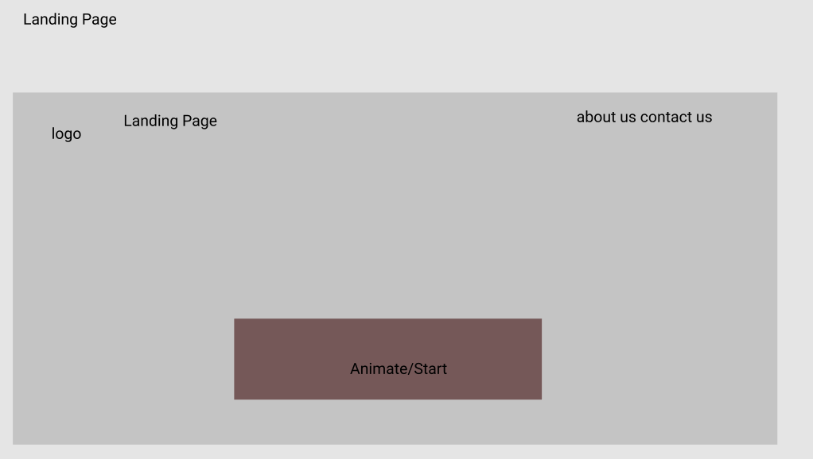
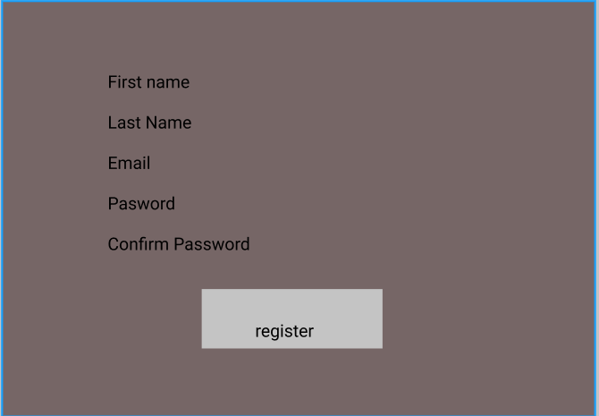
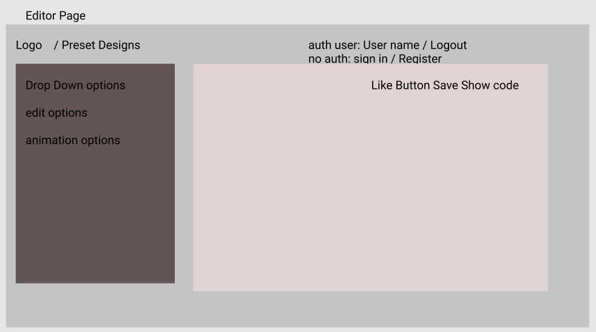
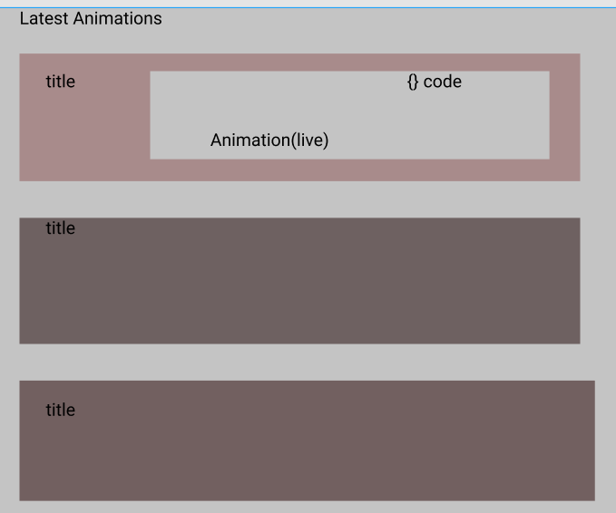
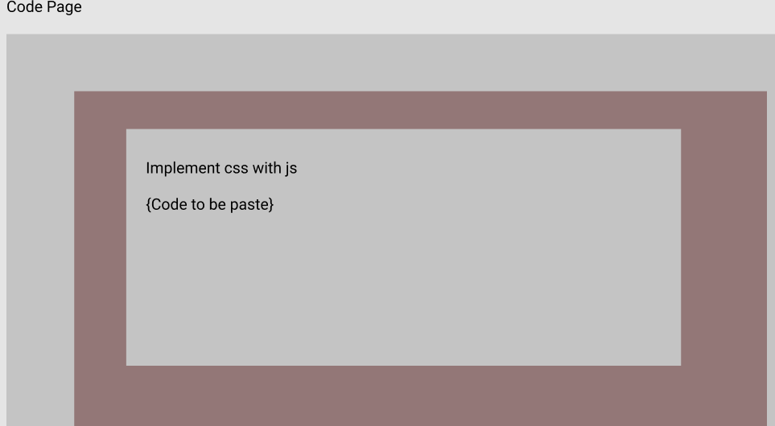
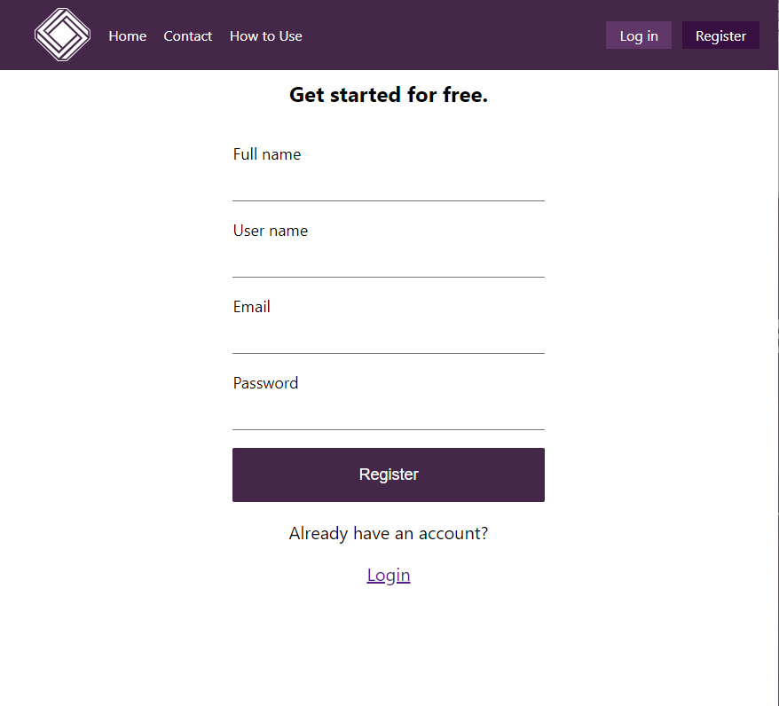
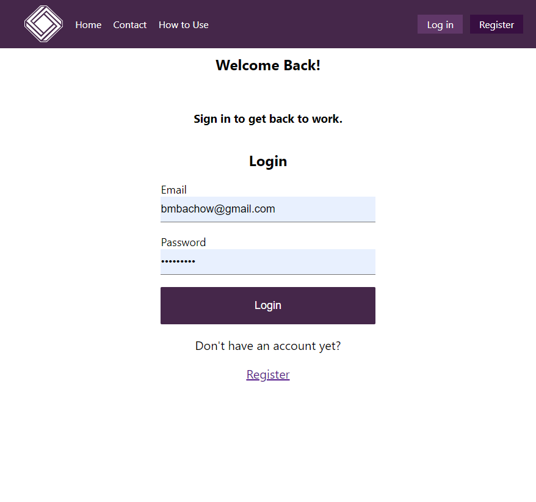
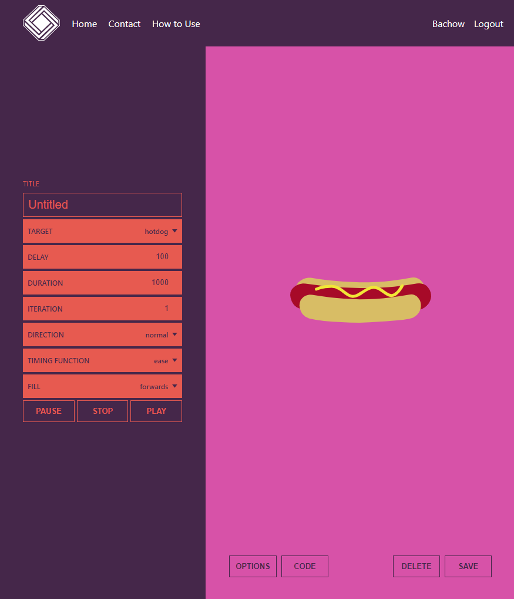
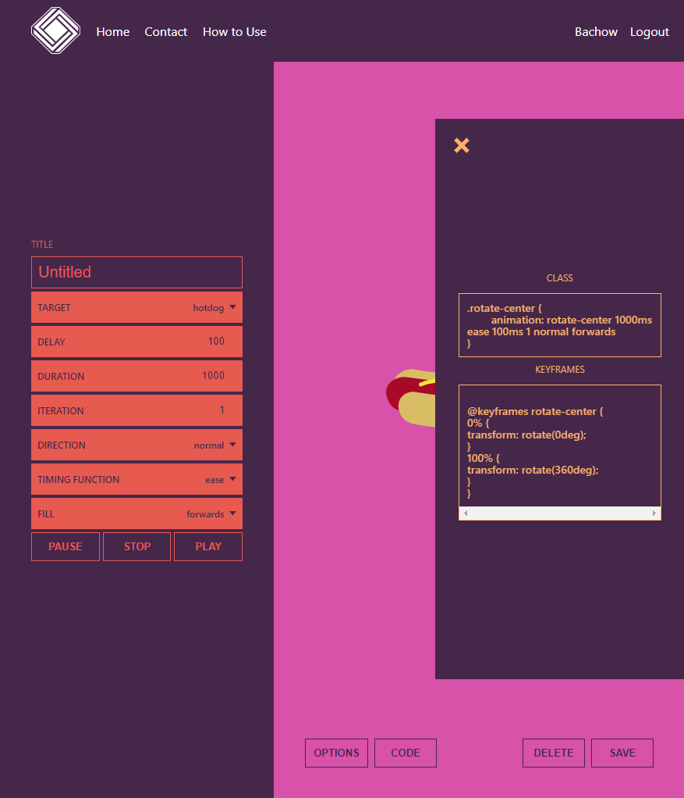
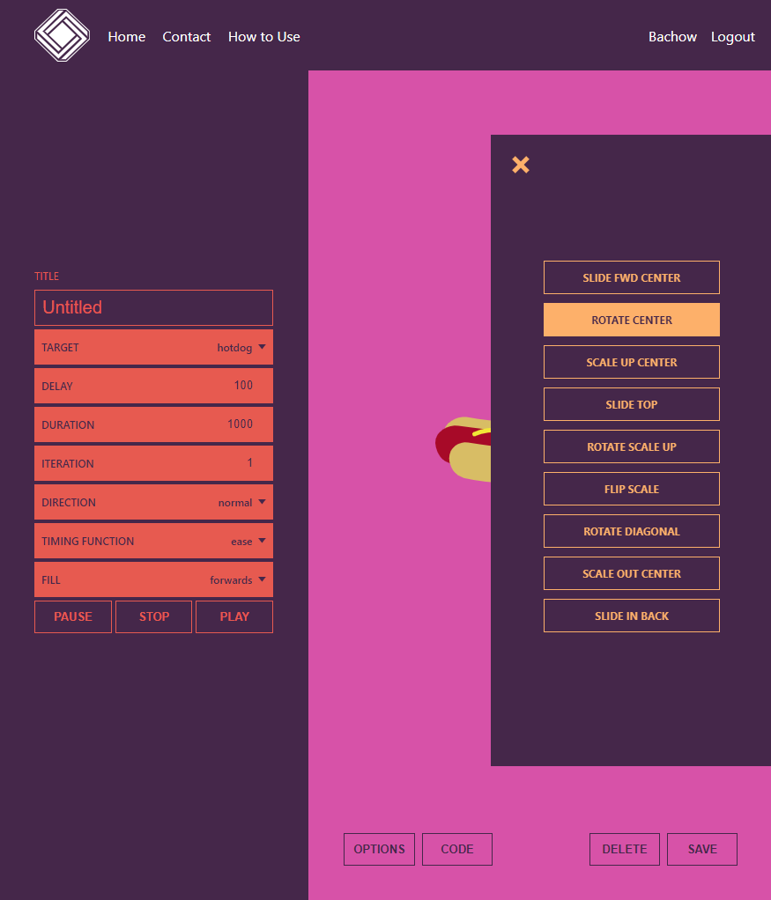

# Team Members
Khandaker Sultana  
Brian Bachow  
Alen Diaz  
Nathaniel Mata  

# AnimationStation Capstone

AnimationStation is an application that lets users create css animations using a graphical interface and then save the corresponding CSS code.

# Features

- Create a unique login
- Choose a target item to animate using the GUI
- Choose from a variety of animation options
- Preview the animation
- Access the CSS code
- Save the animation to your account

## Technology

- Front-End: HTML5, CSS3, JavaScript ES6, React
- Back-End: Node.js, Express.js, Mocha, Chai, RESTful API Endpoints, Postgres
- Prodcution Environment: Heroku, Vercel

## Working Prototype

You can access a working prototype of the:

  React(Client) app here:  
    https://css-animator-capstone-client.vercel.app/  
    
  Node/Express(Server) API here:  
    https://fast-temple-07151.herokuapp.com  

## User Stories

This app is for two types of users: a REGISTERED USER and an UNREGISTERED USER

#### Login

- As a REGISTERED user
    I want to login to my account with my unique username and password and start a logged in session.

---

#### Signup Page

- As an UNREGISTERED user 
    I want to create an account.

---

#### How To Page

- As a REGISTERED/UNREGISTERED user  
    I want to see clear, easily understandable instructions about how to use the application.

---

#### User Dasboard page

- As a REGISTERED user
    I want to access a list of my saved animations

- As a REGISTERED user
    I want to preview my existing animations

---

#### Editor Page

- As a REGISTERED user
    I want to create a new CSS animation

- As a REGISTERED user
    I want to edit an existing CSS animation

---

### Wireframes

Landing Page  
:-------------------------:

Sign Up Page
:-------------------------:

Login Page  
:-------------------------:

Edit Animation Page  
:-------------------------:

Dashboard
:-------------------------:

Code Page
:-------------------------:

User Menu
:-------------------------:

## Screenshots

Landing Page
:-------------------------:

Sign Up Page
:-------------------------:

Login Page
:-------------------------:

Edit Animation Page  
:-------------------------:

Dashboard
:-------------------------:

CSS Code
:-------------------------:

Keyframe Options
:-------------------------:

## API Documentation 

POST /api/auth/login  
- post's a user's credentials for login

POST /api/auth/refresh  
- refreshes a user jwt token requires a valid jwt  

GET /api/animations  
- get a user's animations  

POST /api/animations  
- post a new animation

GET /api/animations/:id  
- get an animation by id

DELETE /api/animations/:id  
- delete an animation by id

PATCH /api/animations/:id  
- update an animation by id

GET /api/users  
- get a user's data 

POST /api/users  
- this endpoint creates a new user at registration

GET /api/users/:user_id  
- get user info by id

DELETE /api/users/:user_id  
- delete a user by id

PATCH /api/users/:user_id  
- update a user by id

## Responsive

App is built to be usable on mobile devices, as well as responsive across mobile, tablet, laptop, and desktop screen resolutions.

## Development Roadmap

This is v1.0 of the app, but future enhancements are expected to include:

-  enable users to view and create animations without having to login
-  a marketplace to see other users' animations

## How to run it

Use command line to navigate into the project folder and run the following in terminal

### Local Server/Node scripts

- clone repo https://github.com/SultanaK/AnimationStation-backend
- To install the node project ===> npm install
- To migrate the database ===> npm run migrate -- 1
- To run Node server (on port 8000) ===> npm run dev
- To run tests ===> npm run test

### Local Client/React scripts

- clone repo https://github.com/nathanielmata/css-animator-capstone-client
- To install the react project ===> npm install
- To run react (on port 3000) ===> npm start
- To run tests ===> npm run test
