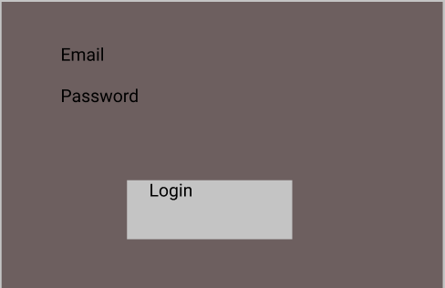
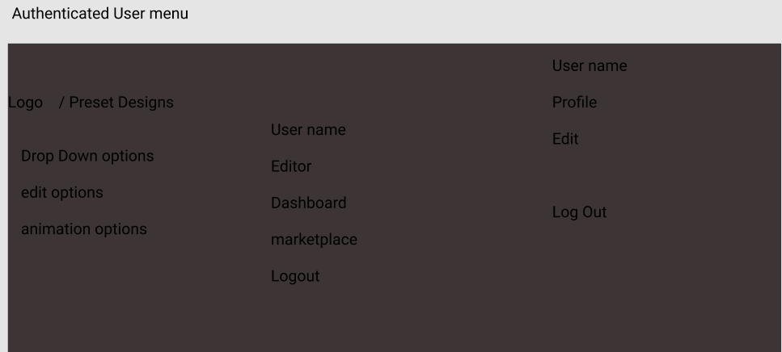
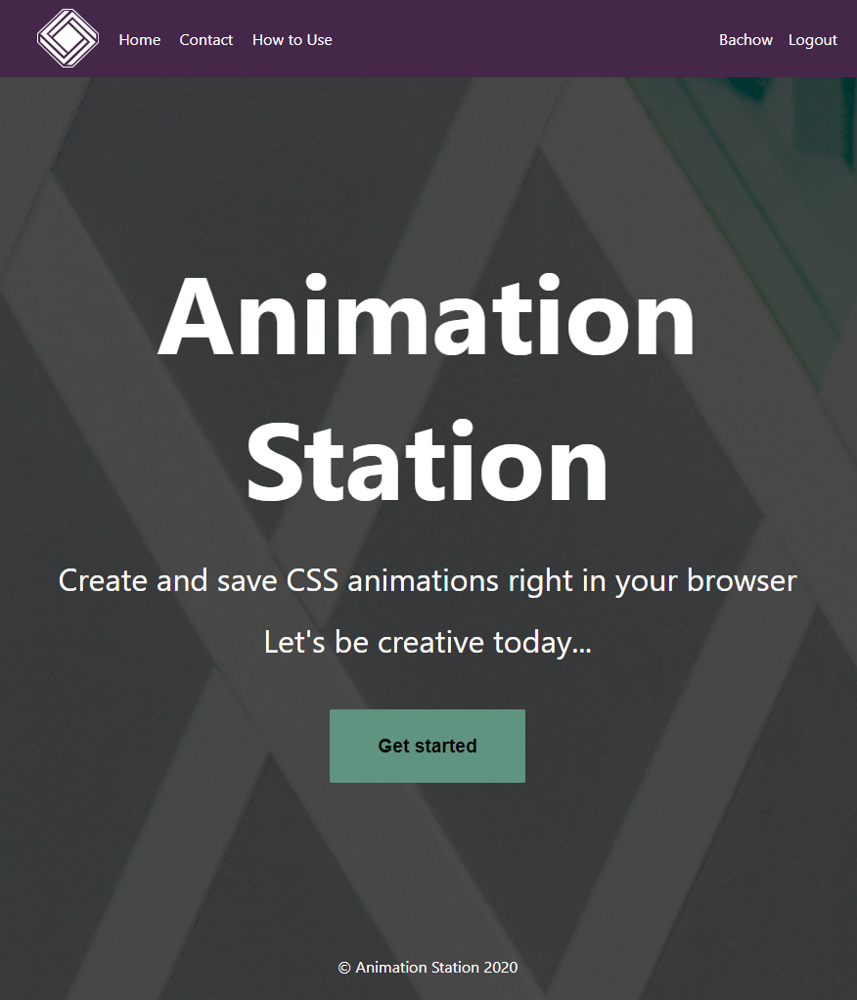
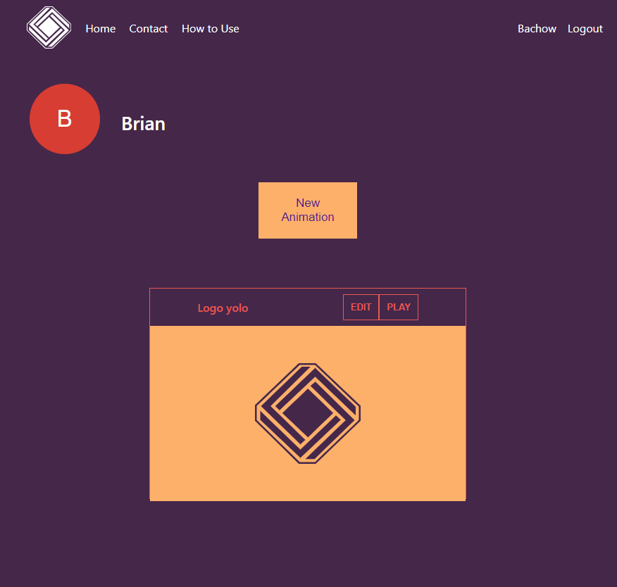

# Team Members
Khandaker Sultana  
Brian Bachow  
Alen Diaz  
Nathaniel Mata  

# AnimationStation Capstone

AnimationStation is an application that lets users create animations using a graphical interface and then save the corresponding CSS code.

# Features

- Create a unique login
- Choose a target item to manipulate with the GUI
- Choose from a variety of animation options
- Preview the animation
- Access the CSS code
- Save the animation

## Technology

- Front-End: HTML5, CSS3, JavaScript ES6, React
- Back-End: Node.js, Express.js, Mocha, Chai, RESTful API Endpoints,Postgres
- Development Environment: Heroku, Vercel

## Working Prototype

You can access a working prototype of the React app here: https://css-animator-capstone-client.vercel.app/ and Node api app here: https://fast-temple-07151.herokuapp.com

## User Stories

This app is for two types of users: a REGISTERED USER and an UNREGISTERED USER

#### Login

- As a REGISTERED user
    I want to login to my account with my unique username and password and start a logged in session.

---

#### Signup Page

- As an UNREGISTERED user 
    I want to create an account.

---

#### How To Page

- As a REGISTERED/UNREGISTERED user  
    I want to see clear, easily understandable instructions about how to use the application.

---

#### User Dasboard page

- As a REGISTERED user
    I want to access a list of my saved animations

- As a REGISTERED user
    I want to preview my existing animations

---

#### Editor Page

- As a REGISTERED user
    I want to create a new CSS animation

- As a REGISTERED user
    I want to edit an existing CSS animation

---

### Wireframes

Landing Page  
:-------------------------:

Sign Up Page
:-------------------------:

Login Page  
:-------------------------:

Edit Animation Page  
:-------------------------:

Dashboard
:-------------------------:

Code Page
:-------------------------:

User Menu
:-------------------------:

## Screenshots

Landing Page
:-------------------------:

Sign Up Page
:-------------------------:

Login Page
:-------------------------:

Edit Animation Page  
:-------------------------:

Dashboard
:-------------------------:

CSS Code
:-------------------------:

Keyframe Options
:-------------------------:

## Front-end Structure - React Components Map (later)

- **Index.js** (stateless)
  - **App.js** (stateful)
    - **LandingPage.js** (stateful) - gets the _"prop name"_ and the _"callback prop name"_ from the **App.js**
      - **Login.js** (stateful) -
      - **Register.js** (stateful) -
    - **Navbar.js** (stateless) -

## Back-end Structure - Business Objects (later)

- Users (database table)
  - id (auto-generated)
  - username (email validation)
  - password (at least 8 chars, at least one alpha and a special character validation)

## API Documentation (later)

API Documentation details:

- get all users

## Responsive

App is built to be usable on mobile devices, as well as responsive across mobile, tablet, laptop, and desktop screen resolutions.

## Development Roadmap

This is v1.0 of the app, but future enhancements are expected to include:

-  enable users to view and create animations without having to login
-  a marketplace to see other users' animations

## How to run it

Use command line to navigate into the project folder and run the following in terminal

### Local Node scripts

- To install the node project ===> npm install
- To migrate the database ===> npm run migrate -- 1
- To run Node server (on port 8000) ===> npm run dev
- To run tests ===> npm run test

### Local React scripts

- To install the react project ===> npm install
- To run react (on port 3000) ===> npm start
- To run tests ===> npm run test

## Reflections

### Lessons Learned
- It is crucial to work on features on their own branches separate from the master.  Merging conflicts can be a major hassle   if branches aren't properly segregated.

### What would I do differently
-  I would have had the team agree to a set of guiding principles with respect to respository management, branching, and merging before we began building the application.